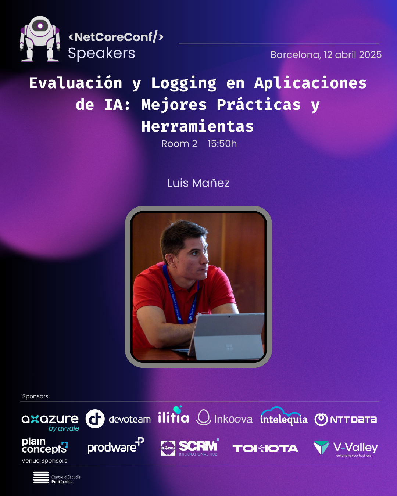

# NetCoreConf Barcelona 2025

12 Abril 2025

Descubre el futuro de la tecnología en Netcoreconf Barcelona 2025, donde la innovación se encuentra con el vibrante y creativo espíritu de una ciudad cosmopolita. Conocida por su arquitectura icónica y su encanto mediterráneo, Barcelona será el escenario perfecto para explorar las últimas tendencias en .NET, Azure, IA, DevOps y Big Data.

## Evaluación y Logging en Aplicaciones de IA: Mejores Prácticas y Herramientas

Has implementado IA en tu aplicación, ¡felicidades! Pero, ¿y ahora qué? Aquí viene la parte divertida: asegurarte de que todo funcione como debe. En esta sesión vamos a hablar de cómo evaluar y monitorear el rendimiento de tus modelos de IA, y te contaremos algunos trucos para gestionar registros de actividad sin volverte loco. También exploraremos las mejores herramientas para mantener todo en orden, como Azure Monitor y Application Insights, que son como tener un asistente personal vigilando que tu IA no se desvíe del camino. Porque ya sabes, lo último que quieres es que tu IA empiece a hacer cosas raras cuando nadie la está mirando.